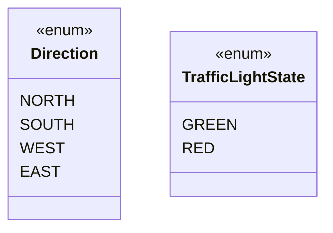
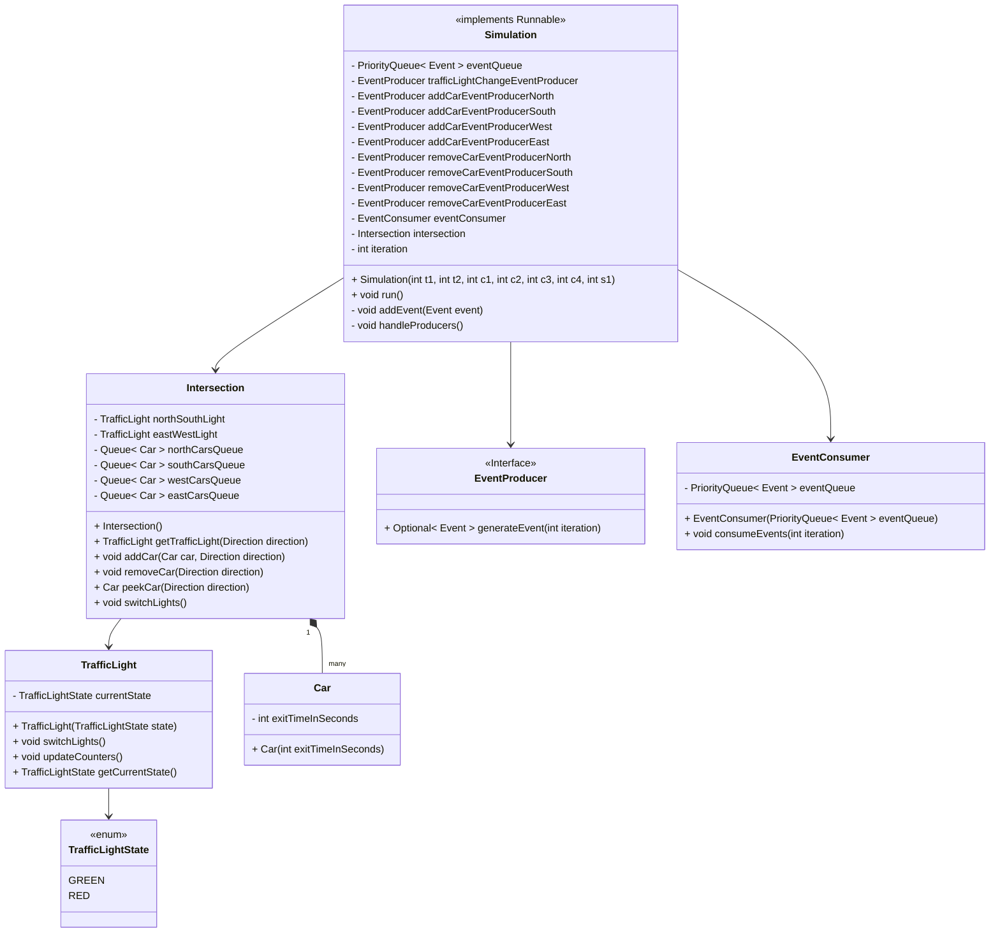

# Traffic Intersection Simulator

This repository serves as a design notes for a traffic intersection simulator. It's designed for a classic 4-way intersection (north-south-east-west).

### Traffic light configuration
At the intersection, each road is equipped with a traffic light that can display either green or red signals. The traffic lights follow a specific configuration where:

* For time interval t1, the traffic lights on the north and south roads display green, while the lights on the west and east roads show red.
* Then, the colors are switched, and for time interval t2, the lights are reversed. The whole pattern repeats cyclically.

### Arrival of cars
Cars approach the intersection from all four directions (north, south, west, and east). 
The rate of incoming cars is defined by the following numeric parameters:

* c1: cars arriving from the north per minute.
* c2: cars arriving from the south per minute.
* c3: cars arriving from the west per minute.
* c4: cars arriving from the east per minute.

## Design notes and diagrams

* The simulation uses discrete events to model actions that occur at specific time.
* The simulation runs in the loop. Each loop iteration within the simulation represents one second.

### Enums
* `TrafficLightState` represents the color on the `TrafficLight`.
* `Direction` enumerates directions for adding/removing `Car` instances or loading `Car` and `TrafficLight` in specific direction.



-----

### Events

* `AddCarEvent` represents an event that adds a car to the intersection from a specified direction. 
The car will exit the intersection after a given duration defined in seconds. A single event can generate more cars based on the `quantity` parameter.
* `RemoveCarEvent` represents an event that removes a car from the intersection in a given direction.
* `TrafficLightChangeEvent` represents an event that switches the traffic lights at the intersection in both north-south and west-east directions. 

* `AbstractIntersectionEvent` is an abstract class representing events that occur at the intersection. It contains the event execution time and a reference to the intersection.

```mermaid
classDiagram

    class Event {
        <<Interface>>
        + int getExecutionTime()
        + void execute()
    }

    class AbstractIntersectionEvent {
        - int executionTime
        - Intersection intersection
        + AbstractIntersectionEvent(int executionTime, Intersection intersection)
        + int getExecutionTime()
        + Intersection getIntersection()
    }

    class AddCarEvent {
        - Direction direction
        - int exitTimeInSeconds
        - quantity
        + AddCarEvent(int executionTime, Intersection intersection, Direction direction, int exitTimeInSeconds, int quantity)
        + void execute()
    }

    class RemoveCarEvent {
        - Direction direction
        + RemoveCarEvent(int executionTime, Intersection intersection, Direction direction)
        + void execute()
    }

    class TrafficLightChangeEvent {
        + TrafficLightChangeEvent(int executionTime, Intersection intersection)
        + void execute()
    }

    Event <|.. AbstractIntersectionEvent
    AbstractIntersectionEvent <|.. TrafficLightChangeEvent
    AbstractIntersectionEvent <|.. AddCarEvent
    AbstractIntersectionEvent <|.. RemoveCarEvent

    AddCarEvent --> Intersection : Add car to Intersection based on Direction
    RemoveCarEvent --> Intersection : Remove car from Intersection based on Direction
    TrafficLightChangeEvent --> Intersection : Switches the traffic lights at the Intersection

    class Intersection {
        (details in Intersection Simulation diagram below)
        + void switchLights()
        + void addCar(Car car, Direction direction)
        + void removeCar(Direction direction)
    }
```

-----

### EventProducers

The individual producers `AddCarEventProducer`, `RemoveCarEventProducer`, and `TrafficLightChangeEventProducer` are responsible for generating specific corresponding events. 
These EventProducers also define the `executionTime` property for each event, and they calculate the `executionTime` based on the provided simulation parameters.

Interface `EventProducer` is the common interface for all event producers in this simulation. It defines a method to generate an optional event at a given iteration.

```mermaid
classDiagram

    class EventProducer {
        <<Interface>>
        + Optional< Event > generateEvent(int iteration)
    }
    
    class AddCarEventProducer {
        - Direction direction
        - Intersection intersection
        - int exitTimeInSeconds
        - int carsPerMinute
        + AddCarEventProducer(int carsPerMinute, Direction direction, int exitTimeInSeconds, Intersection intersection)
        + Optional< Event > generateEvent(int iteration)
    }

    class RemoveCarEventProducer {
        - Direction direction
        - Intersection intersection
        + RemoveCarEventProducer(Direction direction, Intersection intersection)
        + Optional< Event > generateEvent(int iteration)
    }

    class TrafficLightChangeEventProducer {
        - int t1
        - int t2
        - Intersection intersection
        - int nextEventTime
        + TrafficLightChangeEventProducer(int t1, int t2, Intersection intersection)
        + Optional< Event > generateEvent(int iteration)
    }

    EventProducer <|.. TrafficLightChangeEventProducer
    EventProducer <|.. AddCarEventProducer
    EventProducer <|.. RemoveCarEventProducer

    AddCarEventProducer --> AddCarEvent : creates
    RemoveCarEventProducer --> RemoveCarEvent : creates
    TrafficLightChangeEventProducer --> TrafficLightChangeEvent : creates

    class AddCarEvent {
        (details in Events diagram above)
    }

    class RemoveCarEvent {
        (details in Events diagram above)
    }

    class TrafficLightChangeEvent {
        (details in Events diagram above)
    }

```

-----

### Intersection simulator

* `Intersection` class allows the management of queues for `Car`s arriving in each `Direction` and provides access to `TrafficLight` in both north-south and west-east directions.
* `Runnable` `Simulation` class allows a simulation of a single traffic intersection based on provided input parameters. It manages `PriorityQueue` of `Event`s, various `EventProducer`s, and `EventConsumer` that executes individual `Event`s.
* For a more illustrative description, `Simulation` class diagram presents `EventProducer`s as individual fields, but in real implementation, there is expected rather a single `Collection<EventProducer>` for easier EventProducers handling.
* If we need to simulate more traffic intersections with different input parameters at the same time, more `Simulation` instances can be created.



-----

## Implementation notes

Further fields and methods (beyond this high-level design) can be implemented to help resolve low-level simulation details, such as:
* Logic for cars leaving the intersection.
* Logic for when to generate `TrafficLightChangeEvent` (not every loop iteration generates an event).
* Logic for when to generate `AddCarEvent` based on the `carsPerMinute` simulation parameter.

## Visualization & Interfaces

If we don't want to read metrics and simulation results only from the console or log files, we could build one of the following interfaces, which offers various visualization options.
* (1) Grafana dashboards - this approach involves using Grafana, Prometheus, Spring Boot Actuator and code instrumentation with the Micrometer library to expose metrics via actuator endpoint.
* (2) REST / GraphQL interface for webapp.
* (3) Serialized metrics and events could be sent also into message broker for further remote consumers.
* (4) Swing JFrame with JLabels - very basic visualization w/ limited capabilities.

## TODOs
* An algorithm that generates `AddCarEvent` in `AddCarEventProducer` based on `carsPerMinute` & `iteration` parameters.
* Clarify simulation termination conditions.
* Collect and print the following metrics:
  * TrafficLight - totalTimeInGreen/Red for each north-south and west-east direction.
  * Intersection - cars in queue for each N/S/E/W direction.
* Optionally - the simulation logic can evaluate whether given input parameters cause constantly increasing traffic jams or whether the traffic throughput is sustainable for the given parameters.

## Alternatives
* Alternatively, this exact simulation of traffic intersection with cars can be done also via AnyLogic software.
  * Simulation model in this repository is rather an exercise, otherwise client's needs and expectations need to be further clarified.

-----

Feel free to post any feedback / comments / ideas or suggestions via [tickets](https://github.com/zruzicka/Simulation/issues) in this repo. Feedback is welcomed.